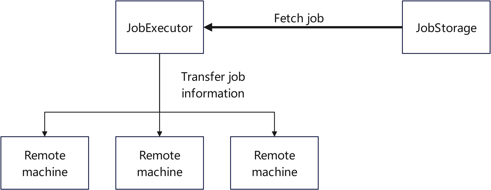

<div style="text-align: center"><h1>TOKIO-SCHEDULER-RS</h1></div>

<div style="text-align: center">基于Tokio的定时任务库</div>

<a href="README.MD">English</a>

# 特点
* 完全异步
* 基于Tokio编写，完全兼容Tokio生态
* 高度自定义性
* 支持自定义Hook
* 支持自动重试
* 默认支持`tracing`

# 例子
```rust
use std::sync::Arc;

use tokio_scheduler_rs::{job_hook::JobHook,job_hook::JobHookReturn,async_trait,DefaultJobExecutor, JobScheduler, MemoryJobStorage, JobContext, JobFuture,Value,ScheduleJob};

struct ExampleJob;

impl ScheduleJob for ExampleJob{
    fn get_job_name(&self) -> String {
        String::from("ExampleJob")
    }

    fn execute(&self, ctx: JobContext) -> JobFuture {
        Box::pin(async move{
            println!("Hello, World! My JobId is {}",ctx.get_id());
            Ok(Value::default())
        })
    }
}

struct ExampleHook;

#[async_trait]
impl JobHook for ExampleHook {
    async fn on_execute(&self, name: &str, id: &str, args: &Option<Value>) -> JobHookReturn {
        println!(
            "Task: {} with id: {} and args: {:#?} is going to execute!",
            name, id, args
        );
        JobHookReturn::NoAction
        // If you want to Cancel this running ONLY THIS TIME:
        // JobHookReturn::CancelRunning
        // or you want to Cancel this running and remove this schedule forever:
        // JobHookReturn::RemoveJob
    }
    async fn on_complete(
        &self,
        name: &str,
        id: &str,
        args: &Option<Value>,
        result: &anyhow::Result<Value>,
        retry_times: u64,
    ) -> JobHookReturn {
        println!(
            "Task: {} with id: {} and args: {:#?} is complete! Result is: {:#?}, retry time is: {}",
            name, id, args, result, retry_times
        );
        JobHookReturn::NoAction
        // If you want to Cancel this running and remove this schedule forever:
        // JobHookReturn::RemoveJob
        // Or if you want to retry this job:
        // JobHookReturn::RetryJob
    }
    async fn on_success(
        &self,
        name: &str,
        id: &str,
        args: &Option<Value>,
        return_vaule: &Value,
        retry_times: u64,
    ) -> JobHookReturn {
        println!(
            "Task: {} with id: {} and args: {:#?} is complete! ReturnValue is: {:#?}, retry time is: {}",
            name, id, args, return_vaule, retry_times
        );
        JobHookReturn::NoAction
        // If you want to Cancel this running and remove this schedule forever:
        // JobHookReturn::RemoveJob
        // Or if you want to retry this job:
        // JobHookReturn::RetryJob
    }
    async fn on_fail(
        &self,
        name: &str,
        id: &str,
        args: &Option<Value>,
        error: &anyhow::Error,
        retry_times: u64,
    ) -> JobHookReturn {
        println!(
            "Task: {} with id: {} and args: {:#?} is complete! Error is: {:#?}, retry time is: {}",
            name, id, args, error, retry_times
        );
        JobHookReturn::NoAction
        // If you want to Cancel this running and remove this schedule forever:
        // JobHookReturn::RemoveJob
        // Or if you want to retry this job:
        // JobHookReturn::RetryJob
    }
}

#[tokio::main]
async fn main() {
    // Create a new `job_storage`, you can impl it by yourself.
    // !!!  PLEASE NOTICE THAT MEMORYJOBSTORAGE SHOULD NOT BE USED IN PRODUCTION  !!!
    let job_storage = Arc::new(MemoryJobStorage::new(chrono::Utc));
    // Create a new `job_executor`.
    // You should register your job hook here
    let job_executor = DefaultJobExecutor::new(
        job_storage.to_owned(),
        Some(10),
        Some(Box::new(ExampleHook)),
        30
    );
    let scheduler = JobScheduler::new(job_storage, job_executor);

    // Register a job
    scheduler.register_job(Box::new(ExampleJob)).await.unwrap();

    // Set a schedule with given cron expression.
    // !!! PLEASE NOTICE THAT YOU MUST REGISTER THE JOB FIRST !!!
    scheduler
        .add_job(&ExampleJob.get_job_name(), "* * * * * * *", &None)
        .await
        .unwrap();

    // Don't forget to start it.
    println!("Start scheduler");
    scheduler.start();

    tokio::time::sleep(std::time::Duration::from_secs(10)).await;

    // Wait for all jobs are processed and stop the schedule.
    // The `JobExecutor` will stop execute NEW job once you execute this.
    println!("Stop scheduler");
    scheduler.wait_for_stop().await;
}
```

# 例子
你可以查看在`examples`文件夹中的例子

# 贡献
如果你有任何问题或好的想法，可以创建一个Issue或Pull Request。

欣赏百花齐放，乐见各色贡献！

# 分布式执行
你可以自定义一个`JobExecutor`，这个`Executor`从`JobStorage`获取到任务信息后不立即执行，而是通过网络或其他方式将任务信息传递到远程的机器上。

在远程机器上，你需要实现一个`Job`，这个`Job`和`JobStorage`中的名字是一样的，然后利用接收到的信息组成`JobContext`去执行。



# 路线图
* 添加更多测试实例
* 添加开箱即用的分布式任务执行系统

# 许可证
MIT